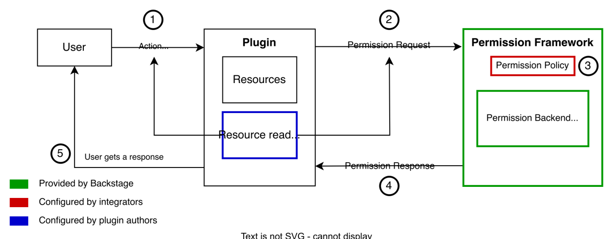

# Đề xuất tích hợp Backstage cho Project Portal

> Triển khai trên Virtual Machine

---

## Giới thiệu

- Backstage là opensource, cung cấp một nền tảng cốt lõi giúp các đội ngũ Platform Engineering tự thiết kế một "giao diện duy nhất" (Single Pane of Glass). Nơi đây sẽ tập hợp toàn bộ hệ sinh thái từ microservices, hạ tầng, tài liệu cho đến các công cụ CI/CD về một mối.
- Mọi người có thể tự đóng góp tính năng của mình, dễ maintain và phát triển mới.
- Có nhiều plugin đa dạng có thể nhúng với các tool đang được triển khai tại team, mã nguồn mở có thể viết thêm plugin tuỳ chỉnh.

---

## Các chức năng cốt lõi

### 1. Software Catalog (Danh mục Phần mềm)

Nó quản lý và hiển thị toàn bộ thực thể phần mềm trong công ty (microservices, ứng dụng, thư viện, data pipelines, API...).

- **Giải quyết bài toán:** Trả lời nhanh các câu hỏi như: Dịch vụ này do team nào quản lý? Tài liệu API nằm ở đâu? Trạng thái vận hành hiện tại thế nào? Thông qua một file định nghĩa dạng YAML (`catalog-info.yaml`) nằm ngay trong repo của source code.

### 2. Software Templates (Scaffolder - Khởi tạo dự án)

Công cụ này giúp hiện thực hóa khái niệm "Golden Paths" (Lộ trình chuẩn chỉnh) trong doanh nghiệp.

- **Giải quyết bài toán:** Thay vì để developer tự copy-paste code cũ hoặc tự cấu hình thủ công, họ có thể lên Backstage chọn một template (ví dụ: Spring Boot Service hoặc Next.js App). Hệ thống sẽ tự động khởi tạo repo mới trên GitHub/GitLab, tích hợp sẵn pipeline CI/CD, file cấu hình Kubernetes, các công cụ quét bảo mật (SonarQube, Snyk) đúng theo tiêu chuẩn của tổ chức chỉ sau vài cú click.

### 3. TechDocs (Tài liệu dạng Code)

Backstage áp dụng tư duy "Documentation-as-code".

- **Giải quyết bài toán:** Developer viết tài liệu bằng file Markdown (`.md`) ngay bên cạnh mã nguồn. Khi push code, Backstage sẽ tự động thu thập, biên dịch và hiển thị tập trung trên portal. Tài liệu sẽ không bao giờ bị "bỏ quên" hay thất lạc trên Confluence hay Notion nữa.

### 4. Hệ sinh thái Plugins (Khả năng mở rộng)

Backstage có một chợ plugin khổng lồ và cho phép tự viết plugin bằng React. Nó có thể kết nối trực tiếp với Kubernetes, ArgoCD, Prometheus, Jira, Datadog, AWS, v.v. Developer có thể xem trạng thái của các Pods, tiến độ deploy hay kết quả quét lỗi bảo mật của dịch vụ ngay trên giao diện Backstage mà không cần chuyển đổi tab qua lại giữa hàng chục công cụ khác nhau.

---

## CÁC MỤC ĐÃ HOÀN THÀNH

### 1. Tích hợp xác thực Keycloak với phân quyền RBAC

- Phù hợp với việc đã có user và group của các phòng ban trên Keycloak, map tất cả các thông tin đó vào Backstage. Keycloak hỗ trợ xác thực các user vào UI Backstage, kết hợp RBAC trong Backstage để giải quyết được phân quyền về phòng ban, chỉ những user thuộc phòng ban mới có quyền xem được những tài nguyên liên quan.

- **Lý do chọn giải pháp này:**

#### 1.1 Tính linh hoạt

- Group và user được tạo tập trung riêng trên Keycloak, trường hợp thêm mới hay xoá user sẽ được áp dụng ngay lập tức trên Backstage UI, tránh các trường hợp user đã nghỉ vẫn có quyền vào UI. (Mở rộng thêm có thể dựng thêm một luồng tự động cập nhật từ cây thư mục sang user và group trên Keycloak).
- Sau khi đã xác thực, trên Backstage, có thêm 1 lớp RBAC tích hợp vào plugin authen Keycloak mà không cần phải thực hiện bất kỳ thay đổi nào trong core Backstage.

#### Sơ đồ xác thực

---

### 2. Tổng quan các kết quả đạt được

#### 2.1 Trang Quản lý tập trung

##### A. Đối với Manager

- **Mô hình ví dụ một project của team như sau:**

- Đây là mô hình triển khai, khi đưa vào một trang quản lý và mô hình hoá lại dưới dạng catalog như sau:

**Giải thích sơ đồ phụ thuộc:**

- Services **order-api** cung cấp 2 API sẽ có dạng `apiProvidedBy` vào `order-events` và `order-openapi`, đọc DB là `dependsOn` `order-postgres-db`.
- Services **order-worker** sử dụng 2 API do order-api cung cấp nên có dạng `consumeApi` vào 2 API `order-events` và `order-openapi`, đẩy event vào topic Kafka nên có dạng là `dependsOn` `order-kafka-topic`.

---

- Trang UI sau khi xác thực thành công, user sẽ thấy project (component) user hiện đang nắm.

**User A — thuộc group Devops:**

**User B — thuộc group Infrastructure Platform:**

- User manager sẽ có quyền xem được tất cả các project của phòng ban.

- Nhấn vào từng project (component), manager có thể xem được ai đang nắm project này.

- Xem được Project (component) này đang cấp phát API nào.

- Xem được Project (component) này đang dùng những thành phần phụ thuộc nào, ví dụ: đang đọc tới DB nào, đọc tới Kafka topic nào, …

- Xem được tài liệu vận hành và source git của project đó.
- Ngoài ra còn nhiều tính năng khác như gán tag kiểu services, tag life cycle để note các project nào xây mới, duy trì, quan trọng, hay không còn dùng nữa.

---

> **Vấn đề hiện tại:** Hạ tầng lớn với rất nhiều microservices nhưng rất nhiều services chẳng biết owner, services đang gọi tới services nào, khi có lỗi xảy ra. Ví dụ: API bị lỗi thì project nào đang deploy API đó, ai nắm…

> **Cách giải quyết:** Chuẩn hoá lại hạ tầng từng bước, giúp người quản lý có cái nhìn tổng quan hơn về nhân sự, project của team và có thể tự chủ việc xác định nguồn gốc lỗi xảy ra thay vì đợi owner lên xác nhận.

---

##### B. Đối với nhân viên

- **Viết TechDocs cho từng project**, file `.md` được lưu tại git, dễ dàng triển khai mà không cần đến tool khác.

- **Tích hợp hệ monitor Grafana vào từng project**, giúp nhân viên chủ động hơn trong việc kiểm tra resource của từng dịch vụ mình vận hành thay vì đợi phản hồi từ team system như cách vận hành kiểu cũ.

- **Chạy pipeline theo chuẩn được cấu hình của Devops team.**

- **Đối với project mà các app chạy trên K8s**, có thể xem được các pod được deploy mà không cần SSH hay đi vào Rancher.
- Việc thực hiện authen từ Backstage tới cluster K8s được bảo mật theo session Keycloak khi user đăng nhập vào (như trên bước 1).

> **Tham khảo:** [Kubernetes OpenID Connect Tokens](https://kubernetes.io/docs/reference/access-authn-authz/authentication/#openid-connect-tokens)

**Luồng xác thực:**

- Đáp ứng đủ các chuẩn bảo mật **Zero Trust Architecture** (Mọi truy cập đều phải xác thực và được cấp quyền) và **Separation of Duties - SoD** (Tách biệt vai trò giữa Developer, Platform và Security) phù hợp với môi trường production.

- Ngay trong project sẽ thấy được các pod nằm trong K8s như sau:

- Đồng thời có thể xem được cả application của ArgoCD.

