# Đề xuất tích hợp Backstage cho Project Portal

> Triển khai trên Virtual Machine

---

## Điểm nghẽn trong hệ thống và nghiên cứu hướng giải quyết

> Để hiểu Backstage giải quyết được gì, hãy bắt đầu từ vấn đề thực tế ở production.

Đây là vấn đề cốt lõi: khi một team có hàng trăm microservices chạy trên production, thông tin về chúng nằm rải rác ở Confluence, Slack, GitLab, spreadsheet — và **không ai biết chắc ai đang chịu trách nhiệm cho cái gì**. Backstage Software Catalog giải quyết điều đó theo 5 hướng cụ thể:

### 1. Xác định ownership — "Ai owns service này khi lúc 3 giờ sáng có incident?"

#### Vấn đề

Đây là câu hỏi đau nhất ở production. Không có catalog, bạn phải hỏi Slack, tìm commit author, gọi điện... Quá trình này tiêu tốn thời gian khi incident đang xảy ra.

#### Giải pháp

Với Backstage, mỗi service khai báo ownership trực tiếp trong file `catalog-info.yaml`:

```yaml
apiVersion: backstage.io/v1alpha1
kind: Component
metadata:
  name: orders-service
spec:
  type: service
  owner: group:payment-team
  lifecycle: production
```

> **Kết quả:** Khi `orders-service` down, có thể xác định được nhanh tổng quan các services phụ thuộc, dễ dàng tra cứu khi cần.

---

### 2. Dependency mapping — "Nếu tôi deploy, cái gì bị ảnh hưởng?"

#### Vấn đề

Ở production với 50+ service, bạn không thể nhớ hết dependency chain. Một thay đổi nhỏ ở upstream service có thể gây cascade failure cho nhiều downstream services.

#### Giải pháp

Backstage vẽ dependency thành graph thông qua khai báo trong catalog:

```yaml
apiVersion: backstage.io/v1alpha1
kind: Component
metadata:
  name: orders-service
spec:
  type: service
  consumesApis:
    - auth-api
    - payment-api
  providesApis:
    - orders-api
  dependsOn:
    - component:postgres
    - component:redis
```

> **Kết quả:** Trước khi deploy, engineer nhìn vào graph biết ngay: *"nếu tôi thay đổi `auth-api`, 3 downstream services kia bị ảnh hưởng."*

---

### 3. Lifecycle management — "Service nào đang deprecated? Service nào production-ready?"

#### Vấn đề

Sau 2 năm vận hành, nhiều team để lại **"zombie services"** — chạy nhưng không ai maintain, không ai dám tắt. Chúng tiêu tốn tài nguyên và tạo ra rủi ro bảo mật tiềm ẩn.

#### Giải pháp

Backstage giải quyết bằng trường `lifecycle` trong catalog:

```yaml
spec:
  lifecycle: deprecated   # Các giá trị: experimental | production | deprecated
```

| Lifecycle        | Ý nghĩa                                           |
|------------------|----------------------------------------------------|
| `experimental`   | Đang phát triển, chưa sẵn sàng cho production      |
| `production`     | Đang hoạt động ổn định trên production              |
| `deprecated`     | Không còn được maintain, cần lên kế hoạch loại bỏ   |

> **Kết quả:** Catalog filter ngay ra: *"có 3 service đang deprecated, team nào owns, nên xử lý thế nào?"*

---

### 4. Documentation-as-Code — "Docs ở đâu? Đúng hay lỗi thời?"

#### Vấn đề

Confluence/Notion docs thường **lỗi thời** vì tách rời khỏi code. Developer thay đổi API nhưng quên cập nhật docs, dẫn đến thông tin sai lệch và mất thời gian debug.

#### Giải pháp

Backstage dùng **TechDocs** — docs viết bằng Markdown nằm ngay trong repo, build cùng CI/CD pipeline. Khi code thay đổi, docs phải đi kèm — nếu không PR sẽ fail.

**Cấu hình trong `catalog-info.yaml`:**

```yaml
metadata:
  annotations:
    backstage.io/techdocs-ref: dir:.
```

**Cấu trúc thư mục TechDocs:**

```
my-service/
├── catalog-info.yaml
├── mkdocs.yml
├── docs/
│   ├── index.md
│   ├── architecture.md
│   ├── runbook.md
│   └── api-reference.md
└── src/
    └── ...
```

> **Kết quả:** Docs luôn đồng bộ với code. Không còn tình trạng *"docs trên Confluence nói API v1, nhưng production đang chạy v3"*.

---

## CÁC MỤC ĐÃ HOÀN THÀNH

### 1. Tích hợp xác thực Keycloak với phân quyền RBAC

- Phù hợp với việc đã có user và group của các phòng ban trên Keycloak, map tất cả các thông tin đó vào Backstage. Keycloak hỗ trợ xác thực các user vào UI Backstage, kết hợp RBAC trong Backstage để giải quyết được phân quyền về phòng ban, chỉ những user thuộc phòng ban mới có quyền xem được những tài nguyên liên quan.

- **Lý do chọn giải pháp này:**

#### 1.1 Tính linh hoạt

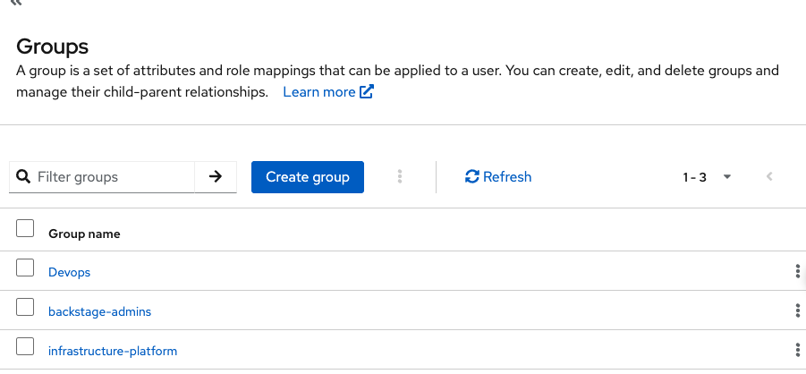

- Group và user được tạo tập trung riêng trên Keycloak, trường hợp thêm mới hay xoá user sẽ được áp dụng ngay lập tức trên Backstage UI, tránh các trường hợp user đã nghỉ vẫn có quyền vào UI. (Mở rộng thêm có thể dựng thêm một luồng tự động cập nhật từ cây thư mục sang user và group trên Keycloak).
- Sau khi đã xác thực, trên Backstage, có thêm 1 lớp RBAC tích hợp vào plugin authen Keycloak mà không cần phải thực hiện bất kỳ thay đổi nào trong core Backstage.

#### Sơ đồ xác thực


---

### 2. Tổng quan các kết quả đạt được

#### 2.1 Trang Quản lý tập trung

##### A. Đối với Manager

- **Mô hình ví dụ một project của team như sau:**

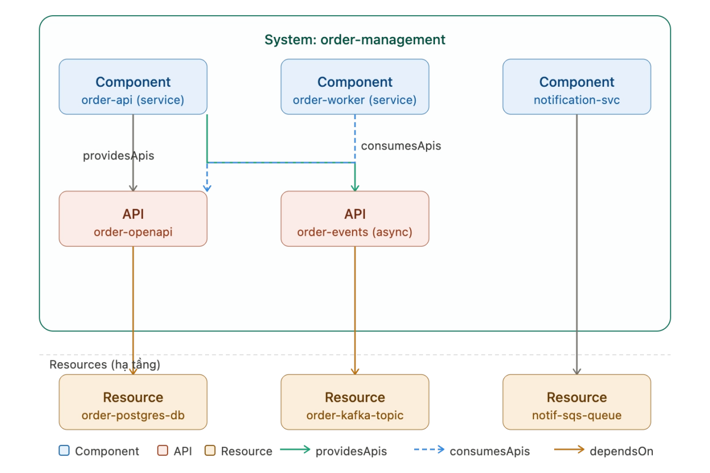

- Đây là mô hình triển khai, khi đưa vào một trang quản lý và mô hình hoá lại dưới dạng catalog như sau:

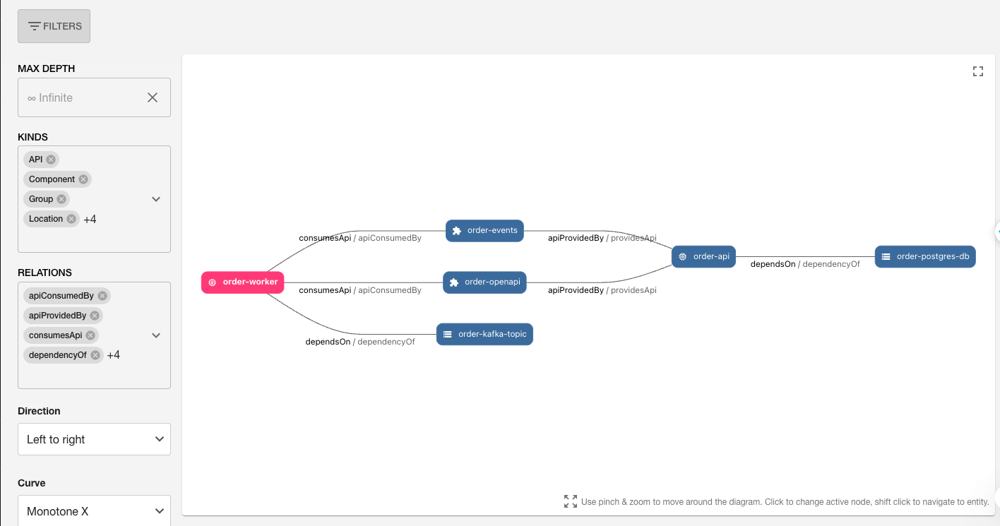

**Giải thích sơ đồ phụ thuộc:**

- Services **order-api** cung cấp 2 API sẽ có dạng `apiProvidedBy` vào `order-events` và `order-openapi`, đọc DB là `dependsOn` `order-postgres-db`.
- Services **order-worker** sử dụng 2 API do order-api cung cấp nên có dạng `consumeApi` vào 2 API `order-events` và `order-openapi`, đẩy event vào topic Kafka nên có dạng là `dependsOn` `order-kafka-topic`.

---

- Trang UI sau khi xác thực thành công, user sẽ thấy project (component) user hiện đang nắm.

**User A — thuộc group Devops:**

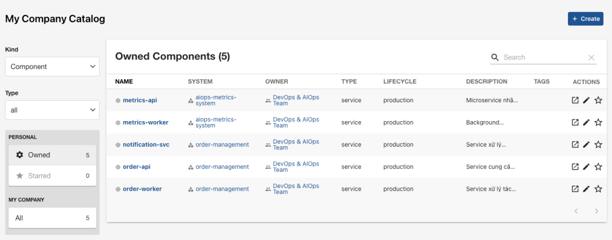

**User B — thuộc group Infrastructure Platform:**

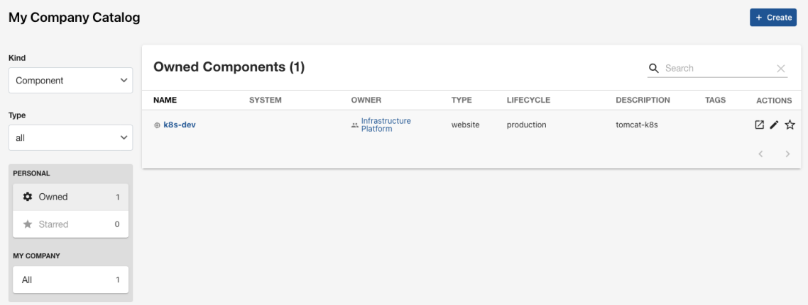

- User manager sẽ có quyền xem được tất cả các project của phòng ban.

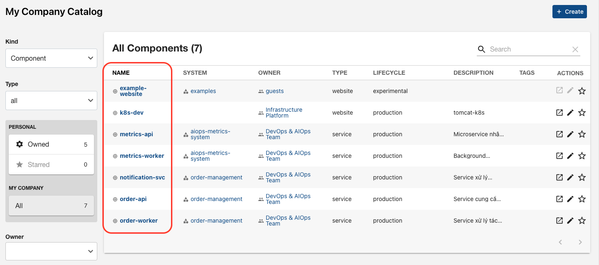

- Nhấn vào từng project (component), manager có thể xem được ai đang nắm project này.

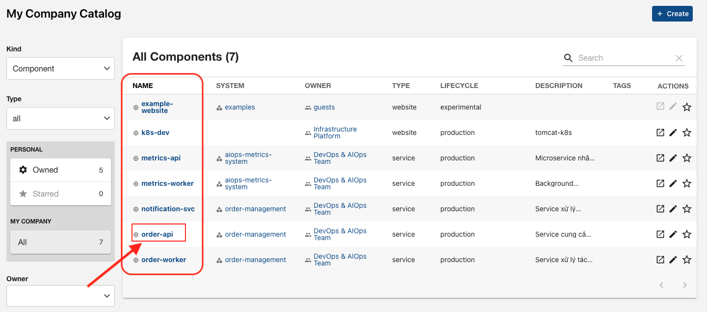

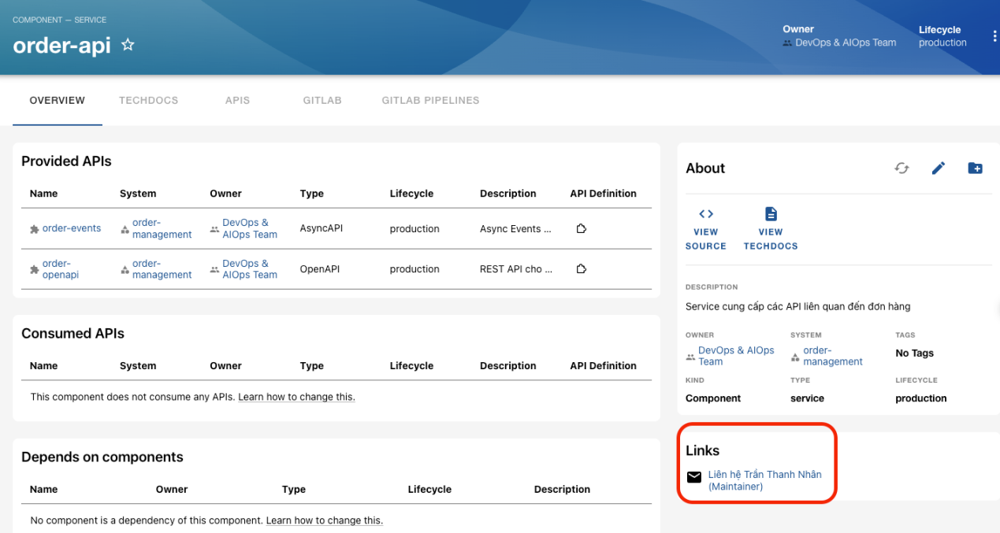

- Xem được Project (component) này đang cấp phát API nào.

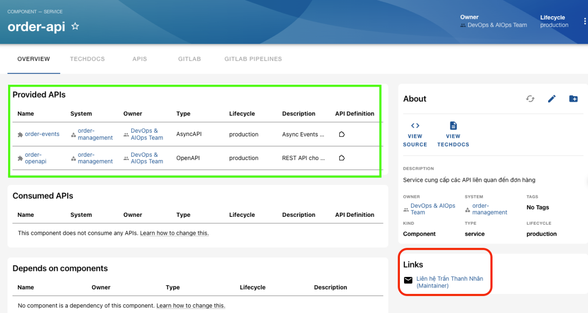

- Xem được Project (component) này đang dùng những thành phần phụ thuộc nào, ví dụ: đang đọc tới DB nào, đọc tới Kafka topic nào, …

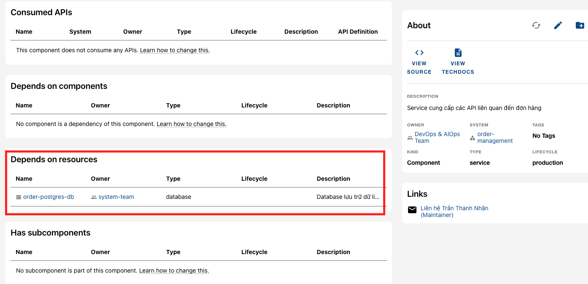

- Xem được tài liệu vận hành và source git của project đó.
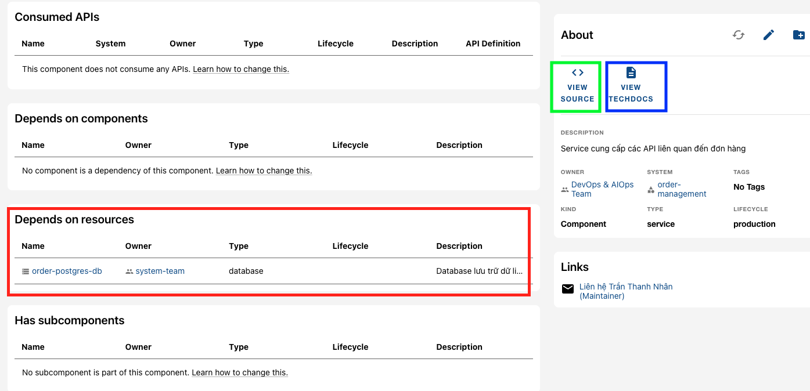
- Ngoài ra còn nhiều tính năng khác như gán tag kiểu services, tag life cycle để note các project nào xây mới, duy trì, quan trọng, hay không còn dùng nữa.
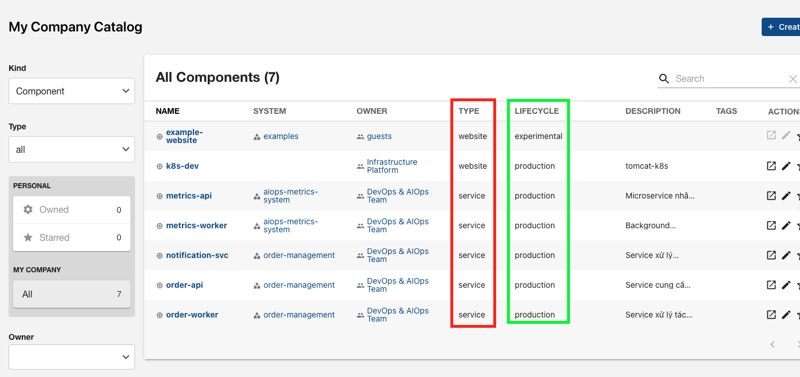
---

> **Vấn đề hiện tại:** Hạ tầng lớn với rất nhiều microservices nhưng rất nhiều services chẳng biết owner, services đang gọi tới services nào, khi có lỗi xảy ra. Ví dụ: API bị lỗi thì project nào đang deploy API đó, ai nắm…

> **Cách giải quyết:** Chuẩn hoá lại hạ tầng từng bước, giúp người quản lý có cái nhìn tổng quan hơn về nhân sự, project của team và có thể tự chủ việc xác định nguồn gốc lỗi xảy ra thay vì đợi owner lên xác nhận.

---

##### B. Đối với nhân viên

- **Viết TechDocs cho từng project**, file `.md` được lưu tại git, dễ dàng triển khai mà không cần đến tool khác.

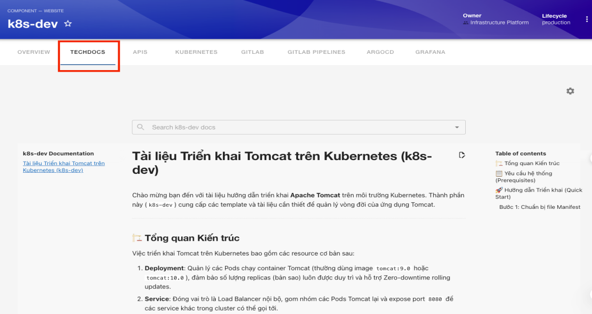

- **Tích hợp hệ monitor Grafana vào từng project**, giúp nhân viên chủ động hơn trong việc kiểm tra resource của từng dịch vụ mình vận hành thay vì đợi phản hồi từ team system như cách vận hành kiểu cũ.

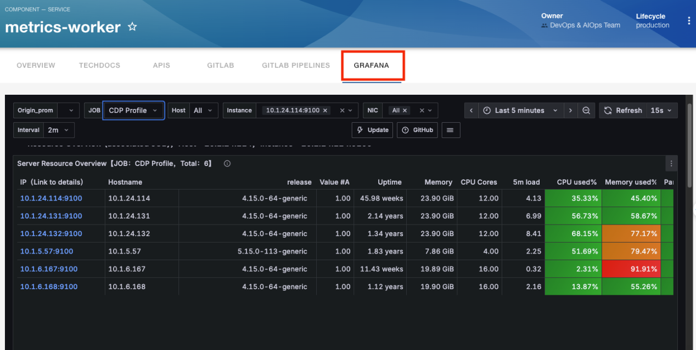


- **Chạy pipeline theo chuẩn được cấu hình của Devops team.**
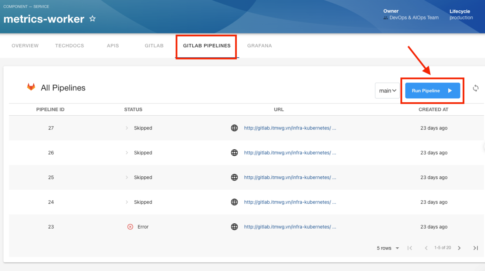

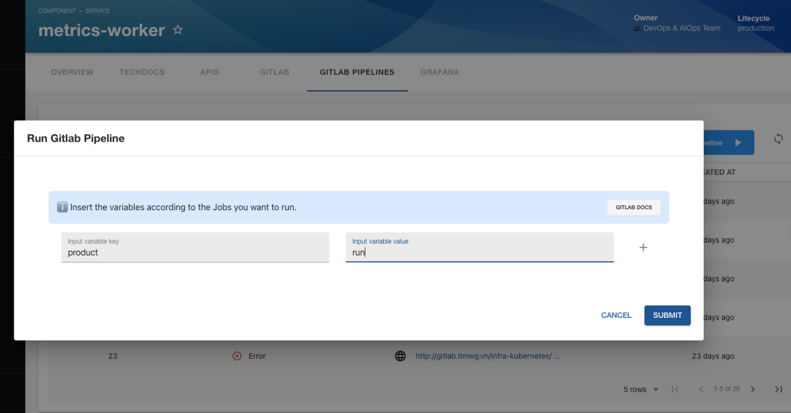


- **Đối với project mà các app chạy trên K8s**, có thể xem được các pod được deploy mà không cần SSH hay đi vào Rancher.
- Việc thực hiện authen từ Backstage tới cluster K8s được bảo mật theo session Keycloak khi user đăng nhập vào (như trên bước 1).
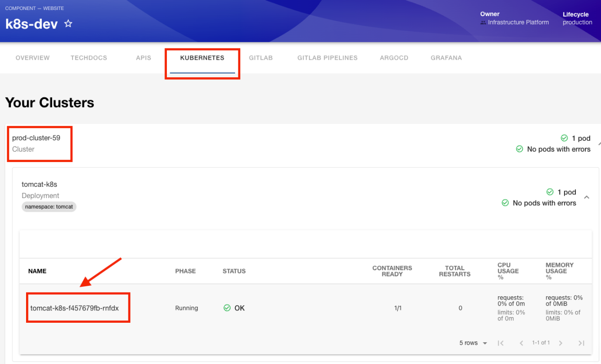

> **Tham khảo:** [Kubernetes OpenID Connect Tokens](https://kubernetes.io/docs/reference/access-authn-authz/authentication/#openid-connect-tokens)

**Luồng xác thực:**

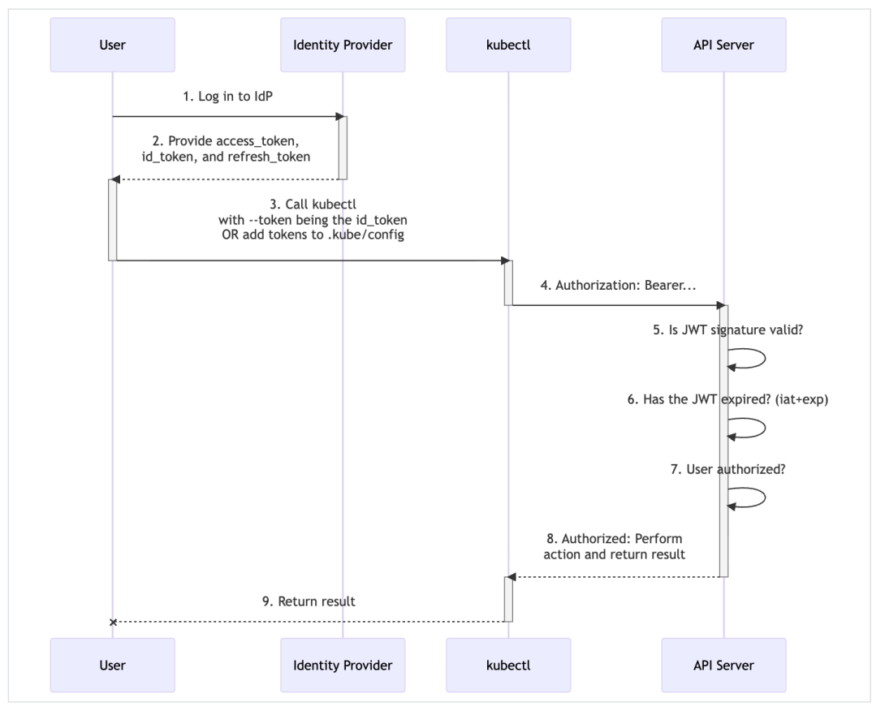


- Đáp ứng đủ các chuẩn bảo mật **Zero Trust Architecture** (Mọi truy cập đều phải xác thực và được cấp quyền) và **Separation of Duties - SoD** (Tách biệt vai trò giữa Developer, Platform và Security) phù hợp với môi trường production.
- Ngay trong project sẽ thấy được các pod nằm trong K8s như sau:
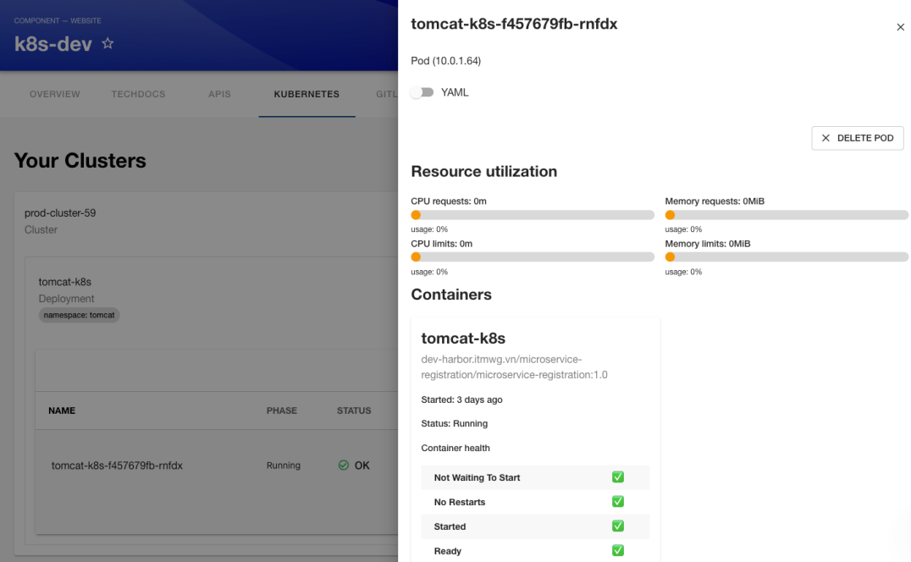

- Đồng thời có thể xem được cả application của ArgoCD.

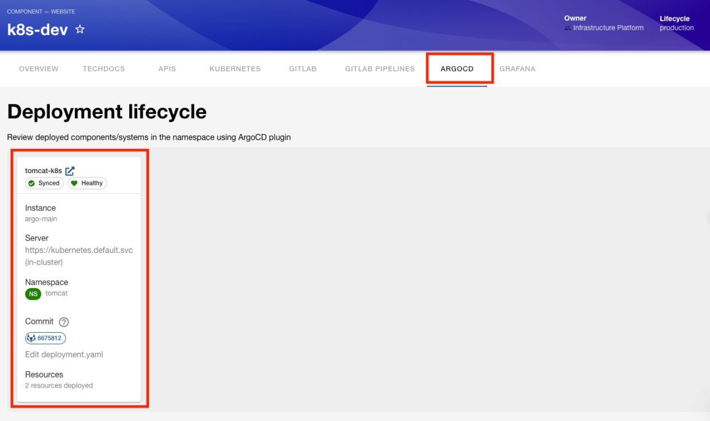
