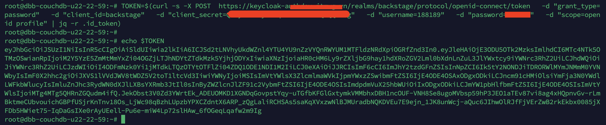
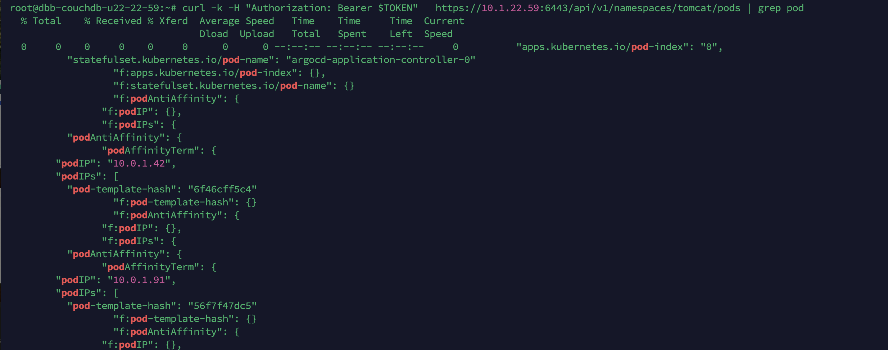
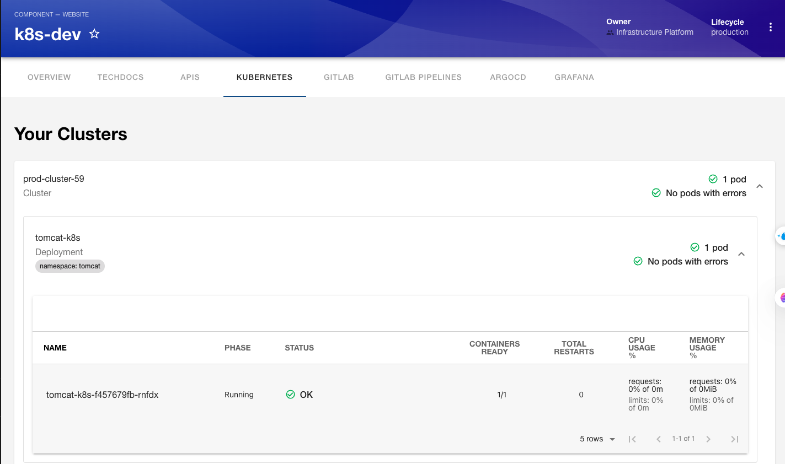
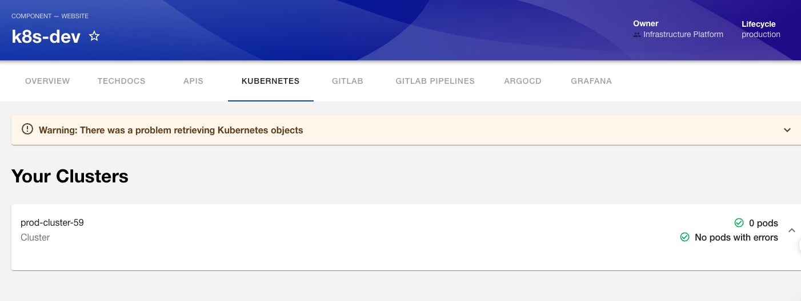

# Xác thực Kubernetes với OpenID Connect (OIDC) qua Keycloak

> Cho phép user từ Backstage truy cập tài nguyên trên Kubernetes cluster mà không cần chia sẻ kubeconfig hay service account token, đảm bảo mọi request đều được xác thực theo danh tính thực của user.

---

## Mục lục

- [Tổng quan](#tổng-quan)
- [Kiến trúc tổng thể](#kiến-trúc-tổng-thể)
- [Luồng xác thực](#luồng-xác-thực)
- [Cấu hình Keycloak](#cấu-hình-keycloak)
  - [Tạo Client cho Kubernetes](#tạo-client-cho-kubernetes)
  - [Cấu hình Mapper](#cấu-hình-mapper)
  - [Test cấu hình](#test-cấu-hình)
- [Cấu hình Kubernetes API Server](#cấu-hình-kubernetes-api-server)
- [Cấu hình RBAC trên Kubernetes](#cấu-hình-rbac-trên-kubernetes)
- [Cấu hình Backstage](#cấu-hình-backstage)
  - [Kubernetes Plugin](#kubernetes-plugin)
  - [OIDC Token Provider](#oidc-token-provider)
- [Kiểm tra và xác minh](#kiểm-tra-và-xác-minh)
- [Nguyên tắc bảo mật](#nguyên-tắc-bảo-mật)
- [Xử lý sự cố](#xử-lý-sự-cố)
- [Tài liệu tham khảo](#tài-liệu-tham-khảo)

---

## Tổng quan

### Vấn đề

Trong mô hình vận hành truyền thống, để xem tài nguyên Kubernetes (pods, deployments, services...), nhân viên cần:

- SSH vào máy chủ hoặc truy cập vào hệ manager như Rancher, Healamp...
- Sử dụng kubeconfig với service account có quyền cao
- Không kiểm soát được ai đang truy cập, truy cập gì, vào lúc nào

Điều này vi phạm nguyên tắc **Least Privilege** và không đáp ứng yêu cầu **audit** trong môi trường production.

### Giải pháp

Sử dụng **OpenID Connect (OIDC)** để Kubernetes API Server xác thực user thông qua **Keycloak** — cùng hệ thống identity đã dùng cho Backstage. Mỗi request tới K8s API đều mang theo **ID Token** của user, cho phép:

- **Xác thực theo danh tính thực** — biết chính xác ai đang truy cập
- **Phân quyền theo group** — RBAC dựa trên group từ Keycloak
- **Audit trail đầy đủ** — mọi action đều gắn với user cụ thể
- **Session-based** — token tự hết hạn, không cần revoke thủ công

---

## Kiến trúc tổng thể

```
┌─────────────────────────────────────────────────────────────────────┐
│                        Backstage UI                                │
│                                                                     │
│  User đăng nhập ──► Keycloak xác thực ──► Nhận ID Token + Refresh  │
└──────────────┬──────────────────────────────────────────────────────┘
               │
               │ Request kèm ID Token (Bearer)
               ▼
┌──────────────────────────────────────┐
│       Backstage Backend              │
│  (Kubernetes Plugin + OIDC Provider) │
│                                      │
│  Đính kèm ID Token vào mỗi request  │
│  gửi tới K8s API Server             │
└──────────────┬───────────────────────┘
               │
               │ API request + Bearer Token
               ▼
┌──────────────────────────────────────┐
│     Kubernetes API Server            │
│                                      │
│  1. Nhận ID Token                    │
│  2. Verify signature với Keycloak    │
│     (JWKS endpoint)                  │
│  3. Trích xuất username + groups     │
│  4. Áp dụng RBAC policies           │
│  5. Cho phép / Từ chối request       │
└──────────────────────────────────────┘
```

---

## Luồng xác thực

```
User                Backstage           Keycloak           K8s API Server
 │                     │                    │                     │
 │──── Login ─────────►│                    │                     │
 │                     │── Auth Request ───►│                     │
 │                     │                    │                     │
 │                     │◄─ ID Token ────────│                     │
 │                     │   + Refresh Token  │                     │
 │                     │                    │                     │
 │── Xem K8s pods ────►│                    │                     │
 │                     │── GET /api/v1/pods ─────────────────────►│
 │                     │   Authorization: Bearer <ID_TOKEN>       │
 │                     │                    │                     │
 │                     │                    │◄── Verify Token ────│
 │                     │                    │    (JWKS endpoint)  │
 │                     │                    │──── Token Valid ───►│
 │                     │                    │                     │
 │                     │                    │     Check RBAC ─────│
 │                     │                    │     (user + groups) │
 │                     │                    │                     │
 │                     │◄──────────────── Pod list ───────────────│
 │◄── Hiển thị pods ───│                    │                     │
 │                     │                    │                     │
```

**Giải thích từng bước:**

1. **User đăng nhập Backstage** → Backstage redirect tới Keycloak login page
2. **Keycloak xác thực** → trả về `ID Token` (JWT) chứa thông tin user và groups
3. **User xem tài nguyên K8s** trên Backstage → Backstage gửi request tới K8s API kèm ID Token
4. **K8s API Server verify token** → gọi tới JWKS endpoint của Keycloak để xác thực chữ ký
5. **K8s áp dụng RBAC** → dựa trên `username` và `groups` trong token để quyết định cho phép/từ chối
6. **Kết quả trả về Backstage** → hiển thị pods, deployments... cho user

---

## Cấu hình Keycloak

### Tạo Client cho Kubernetes

Tạo một OIDC Client riêng trên Keycloak realm cho Kubernetes:

| Thuộc tính | Giá trị | Mô tả |
|---|---|---|
| Client ID | `kubernetes` | Định danh client |
| Client Protocol | `openid-connect` | Giao thức OIDC |
| Access Type | `confidential` | Yêu cầu client secret |
| Valid Redirect URIs | `http://localhost:8000/*` | Callback URI (tuỳ môi trường) |
| Root URL | _(để trống)_ | |

### Cấu hình Mapper

Để Kubernetes nhận được thông tin `groups` từ token, cần tạo **Protocol Mapper** trên client:

#### Groups Mapper

| Thuộc tính | Giá trị |
|---|---|
| Name | `groups` |
| Mapper Type | `Group Membership` |
| Token Claim Name | `groups` |
| Full group path | `OFF` |
| Add to ID token | `ON` |
| Add to access token | `ON` |
| Add to userinfo | `ON` |

> **Quan trọng:** Tắt `Full group path` để K8s nhận tên group đơn giản (ví dụ: `devops`) thay vì đường dẫn đầy đủ (`/departments/devops`).

#### Audience Mapper

K8s API Server yêu cầu claim `aud` trong token phải khớp với `--oidc-client-id`. Cấu hình thêm:

| Thuộc tính | Giá trị |
|---|---|
| Name | `audience` |
| Mapper Type | `Audience` |
| Included Client Audience | `kubernetes` |
| Add to ID token | `ON` |
| Add to access token | `ON` |

#### Test cấu hình 

```

```

---

## Cấu hình Kubernetes API Server

Thêm các flag OIDC vào Kubernetes API Server:

```bash
kube-apiserver \
  --oidc-issuer-url=https://<KEYCLOAK_HOST>/realms/<REALM_NAME> \
  --oidc-client-id=kubernetes \
  --oidc-username-claim=preferred_username \
  --oidc-username-prefix="oidc:" \
  --oidc-groups-claim=groups \
  --oidc-groups-prefix="oidc:" \
  --oidc-ca-file=/etc/kubernetes/pki/keycloak-ca.crt   # Nếu Keycloak dùng self-signed cert
```
Đây là cách cấu hình cũ bằng cách thêm các flag oidc vào kube-apiserver, Cách này giờ ít được dùng vì khó quản lý và chỉ cho phép cấu hình một Identity Provider.
Do đang triển khao trên k8s v1.3x nên tôi sẽ dùng AuthenticationConfiguration (Structured Authentication Config, apiserver.config.k8s.io/v1beta1) nó giải quyết được các vấn đề mà mô hình flag cũ không làm được, và phần lớn đều rất đáng giá trong production. Dưới đây là những vấn đề chính nó giải quyết.

1. Hỗ trợ nhiều Identity Provider (IDP)
2. Hot reload — không cần restart apiserver
3. Xác thực CI/CD và workload bằng OIDC riêng
4. Quản lý cấu hình declaratively bằng file YAML/JSON thay vì flag

**Cấu hình tại manifest của apiserver:**
```bash 
    - --authentication-config=/etc/kubernetes/oidc/auth-config.yaml
```
file auth-config.yaml example:
```yaml
apiVersion: apiserver.config.k8s.io/v1beta1
kind: AuthenticationConfiguration
jwt:
- issuer:
    url: https://keycloak-authdev.itmwg.vn/realms/auth-k8s-headlamp
    audiences:
    - kubernetes
  claimMappings:
    username:
      claim: preferred_username
      prefix: "oidc:"
    groups:
      claim: groups
      prefix: ""
- issuer:
    url: https://keycloak-authdev.itmwg.vn/realms/backstage
    audiences:
    - backstage          # aud của id token = clientId
  claimMappings:
    username:
      claim: preferred_username
      prefix: "oidc:"     # dùng prefix KHÁC để tránh trùng username giữa 2 realm
    groups:
      claim: groups
      prefix: ""
    
```

---

## Cấu hình RBAC trên Kubernetes

Sau khi K8s nhận diện được user và groups từ OIDC token, cần tạo RBAC để phân quyền.

### ClusterRoleBinding cho group

Ví dụ: cho phép group `devops` có quyền **view** trên toàn cluster:

```yaml
apiVersion: rbac.authorization.k8s.io/v1
kind: ClusterRoleBinding
metadata:
  name: oidc-devops-view
subjects:
  - kind: Group
    name: "oidc:devops"       # Prefix + group name từ Keycloak
    apiGroup: rbac.authorization.k8s.io
roleRef:
  kind: ClusterRole
  name: view                  # ClusterRole built-in của K8s
  apiGroup: rbac.authorization.k8s.io
```

### RoleBinding cho namespace cụ thể

Ví dụ: cho phép group `backend-team` chỉ xem pods trong namespace `production`:

```yaml
apiVersion: rbac.authorization.k8s.io/v1
kind: RoleBinding
metadata:
  name: oidc-backend-view
  namespace: production
subjects:
  - kind: Group
    name: "oidc:backend-team"
    apiGroup: rbac.authorization.k8s.io
roleRef:
  kind: ClusterRole
  name: view
  apiGroup: rbac.authorization.k8s.io
```

### Custom ClusterRole (tuỳ chọn)

Nếu cần giới hạn quyền cụ thể hơn role `view` mặc định:

```yaml
apiVersion: rbac.authorization.k8s.io/v1
kind: ClusterRole
metadata:
  name: backstage-reader
rules:
  - apiGroups: [""]
    resources: ["pods", "services", "configmaps"]
    verbs: ["get", "list", "watch"]
  - apiGroups: ["apps"]
    resources: ["deployments", "replicasets"]
    verbs: ["get", "list", "watch"]
  - apiGroups: ["networking.k8s.io"]
    resources: ["ingresses"]
    verbs: ["get", "list", "watch"]
```

---

## Cấu hình Backstage

### Kubernetes Plugin

Cấu hình trong `app-config.yaml` của Backstage để kết nối tới cluster qua OIDC:

```yaml
kubernetes:
  serviceLocatorMethod:
    type: multiTenant
  clusterLocatorMethods:
    - type: config
      clusters:
        - url: https://<K8S_API_SERVER>:6443
          name: production-cluster
          authProvider: oidc
          oidcTokenProvider: okta       
          skipTLSVerify: false          
          caData: <BASE64_ENCODED_CA>   
```

### OIDC Token Provider

Backstage cần biết cách lấy OIDC token từ session Keycloak hiện tại của user. Cấu hình provider:

```yaml
auth:
  environment: production
  providers:
    keycloak:                           # Provider đã dùng cho login
      production:
        metadataUrl: https://<KEYCLOAK_HOST>/realms/<REALM_NAME>/.well-known/openid-configuration
        clientId: backstage
        clientSecret: ${KEYCLOAK_CLIENT_SECRET}
        prompt: auto
```

> **Lưu ý:** Token được tái sử dụng từ session Keycloak khi user đã đăng nhập Backstage. Không cần user đăng nhập lại khi xem tài nguyên K8s.

### Annotation cho Component

Để Backstage plugin biết component nào cần hiển thị thông tin K8s, thêm annotation vào `catalog-info.yaml`:

```yaml
apiVersion: backstage.io/v1alpha1
kind: Component
metadata:
  name: orders-service
  annotations:
    backstage.io/kubernetes-id: orders-service
    backstage.io/kubernetes-namespace: production
    backstage.io/kubernetes-label-selector: app=orders-service
spec:
  type: service
  owner: group:devops
  lifecycle: production
```

---

## Kiểm tra và xác minh

### 1. Kiểm tra Keycloak token

Lấy token từ Keycloak và decode để xác nhận các claims:

```bash
# Lấy token
TOKEN=$(curl -s -X POST \
  "https://<KEYCLOAK_HOST>/realms/<REALM>/protocol/openid-connect/token" \
  -d "client_id=kubernetes" \
  -d "client_secret=<SECRET>" \
  -d "username=<USER>" \
  -d "password=<PASS>" \
  -d "grant_type=password" \
  -d "scope=openid" | jq -r '.id_token')

# Decode payload (phần giữa của JWT)
echo $TOKEN | cut -d'.' -f2 | base64 -d 2>/dev/null | jq .
```

**Kết quả mong đợi:**

```json
{
  "sub": "12345-abcde-...",
  "preferred_username": "nhantran",
  "groups": ["devops", "platform-team"],
  "aud": "kubernetes",
  "iss": "https://<KEYCLOAK_HOST>/realms/<REALM>",
  "exp": 1720000000
}
```

### 2. Kiểm tra K8s API Server nhận token



```bash
# Gọi trực tiếp K8s API với OIDC token
kubectl --token=$TOKEN get pods -n production

# Hoặc dùng curl
curl -k -H "Authorization: Bearer $TOKEN" \
  https://<K8S_API_SERVER>:6443/api/v1/namespaces/production/pods
```


### 3. Kiểm tra trên Backstage UI

1. Đăng nhập Backstage bằng tài khoản Keycloak
2. Mở một component đã cấu hình annotation Kubernetes
3. Chuyển tới tab **Kubernetes**
4. Xác nhận hiển thị danh sách pods, deployments tương ứng

---

## Nguyên tắc bảo mật

Giải pháp này đáp ứng các tiêu chuẩn bảo mật sau:

### Zero Trust Architecture

| Nguyên tắc | Cách thực hiện |
|---|---|
| Không tin tưởng mặc định | Mọi request tới K8s API phải có token hợp lệ |
| Xác thực liên tục | Token có thời hạn ngắn (5–15 phút), tự động refresh |
| Least Privilege | RBAC chỉ cấp quyền `view`, không cho phép `create/delete` |
| Verify explicitly | K8s verify token qua JWKS endpoint mỗi lần nhận request |

### Separation of Duties (SoD)

| Vai trò | Trách nhiệm |
|---|---|
| **Security/IAM Team** | Quản lý Keycloak: tạo user, group, client, policies |
| **Platform Team** | Cấu hình K8s API Server OIDC flags, tạo RBAC rules |
| **Developer** | Sử dụng Backstage UI để xem tài nguyên K8s theo quyền được cấp |

### So sánh với phương pháp truyền thống

| Tiêu chí | Service Account Token | OIDC qua Keycloak |
|---|---|---|
| Xác thực user | ❌ Không biết ai dùng | ✅ Xác thực theo danh tính thực |
| Phân quyền | ❌ Token chung cho mọi người | ✅ RBAC theo group/user |
| Token expiry | ❌ Không hết hạn (hoặc rất dài) | ✅ Tự hết hạn theo session |
| Revoke access | ❌ Phải rotate token thủ công | ✅ Disable user trên Keycloak là xong |

User thuộc backend-team khi đăng nhập vào hệ thống và có quyền xem được services trên K8S


Nếu user không có quyền sẽ như sau 


---

## Xử lý sự cố

### Token bị reject bởi K8s API

```
error: You must be logged in to the server (Unauthorized)
```

**Nguyên nhân có thể:**

1. **Token hết hạn** → Kiểm tra claim `exp` trong token, đảm bảo Backstage refresh token đúng
2. **Issuer URL không khớp** → So sánh `iss` trong token với `--oidc-issuer-url` của API Server
3. **Client ID không khớp** → So sánh `aud` trong token với `--oidc-client-id`
4. **CA certificate lỗi** → API Server không verify được JWKS endpoint của Keycloak

### User không thấy pods trên Backstage

**Kiểm tra:**

1. Component có annotation `backstage.io/kubernetes-id` chưa? Ví dụ: 

```yaml
apiVersion: backstage.io/v1alpha1
kind: Component
metadata:
  name: orders-service
  annotations:
    backstage.io/kubernetes-id: orders-service
    backstage.io/kubernetes-namespace: production
    backstage.io/kubernetes-label-selector: app=orders-service
spec:
  type: service
  owner: group:devops
  lifecycle: production
```

2. User thuộc group nào trên Keycloak? Group đó có RoleBinding/ClusterRoleBinding trên K8s chưa? Ví dụ: 

```yaml
apiVersion: rbac.authorization.k8s.io/v1
kind: RoleBinding
metadata:
  name: backend-team-view
  namespace: production
subjects:
  - kind: Group
    name: backend-team
    apiGroup: rbac.authorization.k8s.io
roleRef:
  kind: Role
  name: view
  apiGroup: rbac.authorization.k8s.io
```


3. Namespace trong annotation có đúng với namespace thực tế không? Ví dụ: 

```yaml
apiVersion: backstage.io/v1alpha1
kind: Component
metadata:
  name: orders-service
  annotations:
    backstage.io/kubernetes-id: orders-service
    backstage.io/kubernetes-namespace: production
    backstage.io/kubernetes-label-selector: app=orders-service
spec:
  type: service
  owner: group:devops
  lifecycle: production
```

### JWKS endpoint không truy cập được

```
oidc: issuer did not match the issuer returned by provider
```

**Kiểm tra:**

- K8s API Server có resolve được DNS của Keycloak host không?
- Firewall có cho phép API Server gọi tới Keycloak port (443/8443) không?
- Certificate chain có đầy đủ không? (Thêm `--oidc-ca-file` nếu cần)

---

## Tài liệu tham khảo

- [Kubernetes - Authenticating with OpenID Connect Tokens](https://kubernetes.io/docs/reference/access-authn-authz/authentication/#openid-connect-tokens)
- [Keycloak - OpenID Connect](https://www.keycloak.org/docs/latest/server_admin/#_oidc)
- [Backstage - Kubernetes Plugin](https://backstage.io/docs/features/kubernetes/)
- [Kubernetes RBAC Authorization](https://kubernetes.io/docs/reference/access-authn-authz/rbac/)
