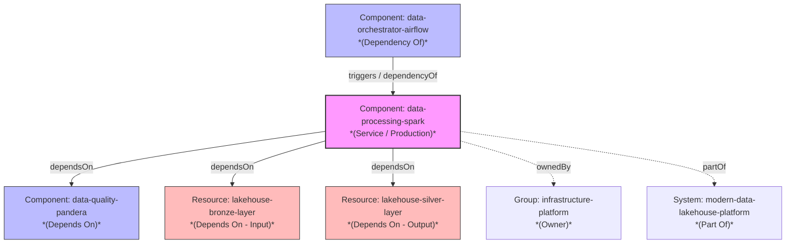
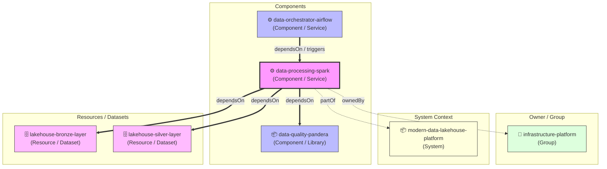

# Optimize MCP Server Token Usage

> Tích hợp Model Context Protocol (MCP) với Google Gemini AI, cho phép người dùng truy vấn Backstage Software Catalog bằng ngôn ngữ tự nhiên.
---
## Lợi ích khi tích hợp vào Backstage Portal
Đối với số lượng services ngày càng lớn trong môi trường production thì việc tìm kiếm thủ công trên UI Backstage rất tốn thời gian và khá phức tạp. Cần phải thao tác nhiều lần trên UI để xác định được mối liên hệ giữa chúng. Do đó, tận dụng nguồn dữ liệu catalog có sẵn trên Backstage để tối ưu hoá việc tìm kiếm bằng cách xây dựng một MCP.

## Kết quả đạt được 
Thực nghiệm trên một tập catalog với chứa data minh hoạ kiến trúc hệ thống về order, bigdata....Với tổng 62 entity
- ví dụ về mô hình được lưu

```mermaid
graph TD
    %% Lớp 0: Root Component
    subgraph Lớp 0 - Root
        POG[component:payment-orchestrator-gateway]
    end

    %% Lớp 1: APIs & Quan hệ trực tiếp
    subgraph Lớp 1 - Direct APIs & Services
        PGA[api:payment-gateway-api]
        FCA[api:fraud-check-api]
        PPA[api:payment-processor-api]
        
        POG -->|providesApi| PGA
        POG -->|consumesApi| FCA
        POG -->|consumesApi| PPA
        
        CWF[component:checkout-web-frontend] -->|consumesApi| PGA
        PSTA[component:pos-store-terminal-app] -->|consumesApi| PGA
        
        FDS[component:fraud-detection-service] -->|providesApi| FCA
        AAD[component:aiops-anomaly-detector] -->|consumesApi| FCA
        
        PPS[component:payment-processor-service] -->|providesApi| PPA
    end

    %% Lớp 2 & 3: Mở rộng các phụ thuộc sâu hơn
    subgraph Lớp 2 & 3 - Extended Dependencies
        %% Từ checkout-web-frontend
        CWF -->|consumesApi| CPA[api:checkout-public-api]
        CAG[component:checkout-api-gateway] -->|providesApi| CPA
        MSA[component:mobile-shopping-app] -->|consumesApi| CPA

        %% Từ pos-store-terminal-app
        PSTA -->|consumesApi| EPA[api:edge-pos-api]
        PSTA -->|consumesApi| SEA[api:store-edge-api]
        EPC[component:edge-pos-controller] -->|providesApi| EPA
        SEG[component:store-edge-gateway] -->|providesApi| SEA

        %% Từ fraud-detection-service
        FDS -->|consumesApi| AFMA[api:ai-fraud-model-api]
        UBAE[component:user-behavior-ai-engine] -->|providesApi| AFMA

        %% Từ aiops-anomaly-detector
        AAD -->|consumesApi| AIA[api:aiops-ingestion-api]
        ALC[component:aiops-log-collector] -->|providesApi| AIA
        AAD -->|dependsOn| AIKES[resource:aiops-kafka-event-stream]
        AAD -->|dependsOn| AITDB[resource:aiops-timeseries-prometheus-db]

        %% Từ payment-processor-service
        PPS -->|consumesApi| ARA[api:aiops-remediation-api]
        AARE[component:aiops-auto-remediation-engine] -->|providesApi| ARA
        PPS -->|dependsOn| GOKB[resource:global-order-kafka-bus]
    end

    %% Ownership & System context styling
    POG -.->|ownedBy| User[user:11646-QKLoi]
    POG -.->|partOf| Sys[system:omnichannel-checkout-system]
```







1. **Giảm thời gian tra cứu`1  :** .
2. **Hạ rào cản sử dụng:** Người dùng không cần biết cấu trúc catalog hay cú pháp filter — chỉ cần hỏi bằng tiếng Việt hoặc tiếng Anh.
3. **Cross-entity reasoning:** AI có thể kết hợp thông tin từ nhiều entity types (System, Component, API, Resource) trong một câu trả lời.
4. **Hỗ trợ incident response:** Nhanh chóng xác định owner, dependencies, lifecycle status khi có sự cố.
5. **Tiết kiệm chi phí:** Sử dụng model `gemini-3.5-flash-lite` với chi phí thấp, kết hợp result filtering để tối ưu token usage.

## Tổng quan
**MCP Chat** là tính năng kết nối Backstage Software Catalog với Google Gemini AI thông qua giao thức **Model Context Protocol (MCP)**. Thay vì phải thao tác thủ công trên giao diện Backstage để tìm kiếm thông tin về services, systems, APIs hay ownership, người dùng chỉ cần **đặt câu hỏi bằng ngôn ngữ tự nhiên** và nhận được câu trả lời tổng hợp từ dữ liệu thực trong Catalog.
### Vấn đề cần giải quyết
| Trước khi có MCP Chat | Sau khi có MCP Chat |
|---|---|
| Phải vào UI Backstage, navigate qua nhiều trang để tìm thông tin | Hỏi trực tiếp: *"Service nào thuộc team Devops?"* |
| Cần biết cấu trúc catalog, filter đúng loại entity | AI tự xác định tool phù hợp để truy vấn |
| Khó tổng hợp thông tin cross-entity (system → component → API) | AI tự động gọi nhiều tool và tổng hợp kết quả |
| Mất thời gian khi cần tra cứu nhanh trong incident | Trả lời tức thì qua chat interface |
---
## Kiến trúc hệ thống
```
┌──────────────────────────────────────────────────────────────────┐
│                        Người dùng                                │
│                  (Câu hỏi bằng ngôn ngữ tự nhiên)               │
└──────────────────────┬───────────────────────────────────────────┘
                       │
                       ▼
┌──────────────────────────────────────────────────────────────────┐
│                    MCP Chat Client                               │
│                                                                  │
│  ┌─────────────────────┐    ┌─────────────────────────────────┐  │
│  │  Gemini AI Agent    │◄──►│  Backstage MCP Client           │  │
│  │  (google-genai)     │    │  (HTTP/SSE JSON-RPC)            │  │
│  │                     │    │                                 │  │
│  │  • Phân tích intent │    │  • Kết nối MCP Server           │  │
│  │  • Chọn tool phù   │    │  • Xác thực Bearer Token        │  │
│  │    hợp              │    │  • Gọi tool & nhận kết quả      │  │
│  │  • Tổng hợp kết quả │    │                                 │  │
│  └─────────────────────┘    └────────────┬────────────────────┘  │
│                                          │                       │
└──────────────────────────────────────────┼───────────────────────┘
                                           │
                                           ▼
┌──────────────────────────────────────────────────────────────────┐
│                  Backstage MCP Server                            │
│          /api/mcp-actions/v1/catalog                             │
│                                                                  │
│  Expose các tools qua JSON-RPC:                                  │
│  • catalog.get-catalog-entity                                    │
│  • catalog.query-catalog-entities                                │
│                                  │
└──────────────────────┬───────────────────────────────────────────┘
                       │
                       ▼
┌──────────────────────────────────────────────────────────────────┐
│               Backstage Software Catalog                         │
│                                                                  │
│  Components │ Systems │ APIs │ Resources │ Groups │ Users        │
└──────────────────────────────────────────────────────────────────┘
```
---
## Luồng hoạt động chi tiết
### 1. Khởi tạo (Initialization)
```
MCP Client                         MCP Server (Backstage)
    │                                      │
    │──── initialize (JSON-RPC) ──────────►│
    │     protocolVersion: "2024-11-05"    │
    │     clientInfo: gemini-mcp-client    │
    │◄──── serverInfo + capabilities ──────│
    │                                      │
    │──── tools/list ─────────────────────►│
    │◄──── Danh sách tools + inputSchema ──│
    │                                      │
    │  Chuyển đổi MCP tools → Gemini       │
    │  FunctionDeclarations                │
    └──────────────────────────────────────┘
```
- Client gửi request `initialize` để thiết lập phiên MCP.
- Client gọi `tools/list` để lấy danh sách tools có sẵn trên Backstage.
- Mỗi tool được chuyển đổi thành `FunctionDeclaration` tương thích với Gemini API (bao gồm xử lý schema `anyOf`, `oneOf`, loại bỏ các keyword không tương thích).
### 2. Xử lý truy vấn (Agentic Loop)
```
Người dùng              Gemini AI                MCP Client              Backstage
    │                      │                        │                       │
    │── "Liệt kê các ────►│                        │                       │
    │   system trong       │                        │                       │
    │   catalog"           │                        │                       │
    │                      │── Phân tích intent ───►│                       │
    │                      │   Chọn tool:           │                       │
    │                      │   catalog.query-        │                       │
    │                      │   catalog-entities     │                       │
    │                      │                        │── tools/call ────────►│
    │                      │                        │   name: catalog.      │
    │                      │                        │   query-catalog-      │
    │                      │                        │   entities            │
    │                      │                        │◄── JSON result ───────│
    │                      │                        │                       │
    │                      │◄── Filtered result ────│                       │
    │                      │                        │                       │
    │                      │── Tổng hợp & trả lời──►│                       │
    │◄── Câu trả lời ─────│                        │                       │
    │    bằng ngôn ngữ     │                        │                       │
    │    tự nhiên          │                        │                       │
    └──────────────────────┴────────────────────────┴───────────────────────┘
```
**Đặc điểm quan trọng:**
- **Agentic Loop (tối đa 10 turns):** Gemini có thể tự quyết định gọi nhiều tool liên tiếp trong một câu hỏi để thu thập đủ thông tin trước khi trả lời.
- **Dynamic Tool Selection:** AI tự xác định tool nào phù hợp với câu hỏi, không cần user chỉ định.
- **Result Filtering:** Kết quả từ Backstage được lọc bỏ các metadata không cần thiết (`uid`, `etag`, `backstage.io/managed-by-location`, ...) trước khi đưa vào context của AI, giúp tiết kiệm token và tăng chất lượng câu trả lời.
---
## Các thành phần chính
### BackstageMCPClient
HTTP Client giao tiếp với Backstage MCP Server qua **Streamable HTTP / SSE JSON-RPC**.
| Phương thức | Chức năng |
|---|---|
| `initialize()` | Thiết lập phiên MCP với server |
| `list_tools()` | Lấy danh sách tools có sẵn |
| `call_tool(name, arguments)` | Thực thi một tool cụ thể |
- Hỗ trợ xác thực **Bearer Token** cho Backstage.
- Tự động parse response dạng SSE (`data: {...}`) hoặc JSON trực tiếp.
### GeminiMCPAgent
AI Agent sử dụng Google Gemini với khả năng **Function Calling**.
| Chức năng | Mô tả |
|---|---|
| Tool Discovery | Tự động phát hiện tools từ MCP Server và chuyển đổi sang Gemini FunctionDeclaration |
| Schema Conversion | Xử lý chuyển đổi JSON Schema → Gemini-compatible schema (xử lý `anyOf`, `oneOf`, loại bỏ `$ref`, `additionalProperties`...) |
| Agentic Loop | Vòng lặp tự động: nhận prompt → gọi tool → nhận kết quả → quyết định gọi thêm tool hoặc trả lời |
| Token Tracking | Theo dõi và báo cáo số token sử dụng (input/output/total) |
### Hàm hỗ trợ
| Hàm | Chức năng |
|---|---|
| `clean_schema_for_gemini()` | Chuẩn hoá JSON Schema cho Gemini API (loại bỏ `$schema`, `$ref`, `propertyNames`...) |
| `sanitize_name()` | Chuyển tên tool MCP (có dấu `.`) sang format hợp lệ cho Gemini (dùng `_`) |
| `filter_unwanted_keys()` | Loại bỏ các metadata thừa từ kết quả Backstage để tiết kiệm token |
---
## Cấu hình
### Biến môi trường (`.env`)
```env
# Endpoint MCP Server trên Backstage
BACKSTAGE_ENDPOINT=http://<backstage-host>:7007/api/mcp-actions/v1/catalog
# Token xác thực Backstage (Bearer)
BACKSTAGE_TOKEN=<backstage_service_token>
# API Key của Google Gemini
GEMINI_API_KEY=<gemini_api_key>
```
### Yêu cầu phía Backstage
Backstage cần cài đặt plugin **MCP Actions** để expose catalog tools qua endpoint MCP:
- Endpoint: `/api/mcp-actions/v1/catalog`
- Protocol: JSON-RPC 2.0 qua HTTP (hỗ trợ SSE streaming)
- Tools mặc định:
  - `catalog.get-catalog-entity` — Lấy chi tiết một entity cụ thể
  - `catalog.query-catalog-entities` — Truy vấn danh sách entities theo filter
---
## Cách sử dụng
### Chế độ Chat tương tác (Interactive REPL)
```bash
python3 mcp_client.py
```
```
> Liệt kê tất cả systems trong catalog
⚙️ [Agent Call] Tool: catalog.query-catalog-entities
   Arguments: { "limit": 10 }
   ✓ Tool completed successfully (1420 bytes)
💡 Agent Response:
Các systems trong Backstage catalog:
1. order-management (Owner: devops-team, Domain: e-commerce)
2. ...
─────────────────────────────────────────────
📊 Token Usage:
   • Input (Prompt) Tokens:     1,245
   • Output (Candidate) Tokens:  312
   • Total Tokens Used:         1,557
─────────────────────────────────────────────
```
### Chế độ Single Query
```bash
python3 mcp_client.py --prompt "Service nào đang owned bởi team devops?"
```
### Tuỳ chỉnh endpoint và model
```bash
python3 mcp_client.py \
  --endpoint http://10.1.6.51:7007/api/mcp-actions/v1/catalog \
  --token <token> \
  --model gemini-3.5-flash-lite \
  --prompt "Cho tôi biết chi tiết về system order-management"
```
---
## Các câu hỏi mẫu
| Câu hỏi | Mục đích |
|---|---|
| *"Liệt kê tất cả systems trong catalog"* | Xem tổng quan systems |
| *"Service nào thuộc team Devops?"* | Tra cứu ownership |
| *"Chi tiết về component orders-service"* | Xem metadata, dependencies, APIs |
| *"API nào đang được cung cấp bởi orders-service?"* | Tra cứu provided APIs |
| *"Có bao nhiêu component đang ở lifecycle deprecated?"* | Đánh giá technical debt |
| *"orders-service phụ thuộc vào những resource nào?"* | Dependency mapping |
---
## Công nghệ sử dụng
| Thành phần | Công nghệ |
|---|---|
| AI Model | Google Gemini (`gemini-3.5-flash-lite`) |
| SDK | `google-genai` (Google Generative AI Python SDK) |
| HTTP Client | `httpx` |
| Protocol | Model Context Protocol (MCP) — JSON-RPC 2.0 |
| Backend | Backstage MCP Actions Plugin |
| Ngôn ngữ | Python 3.9+ |
---

